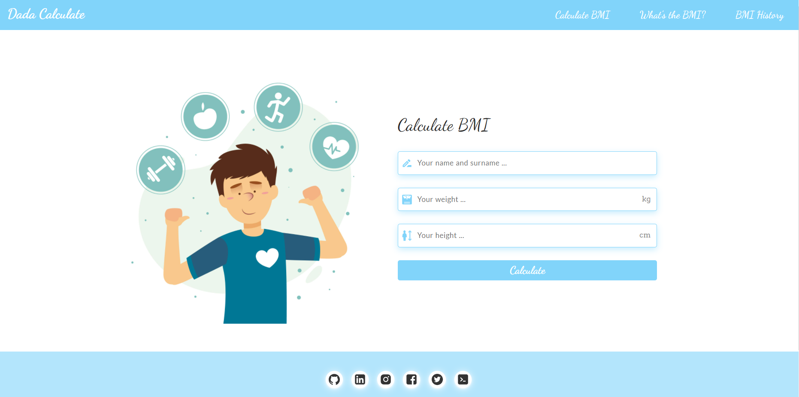
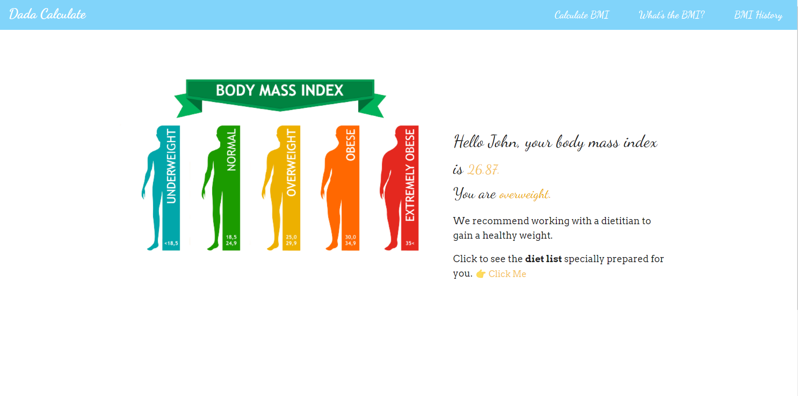
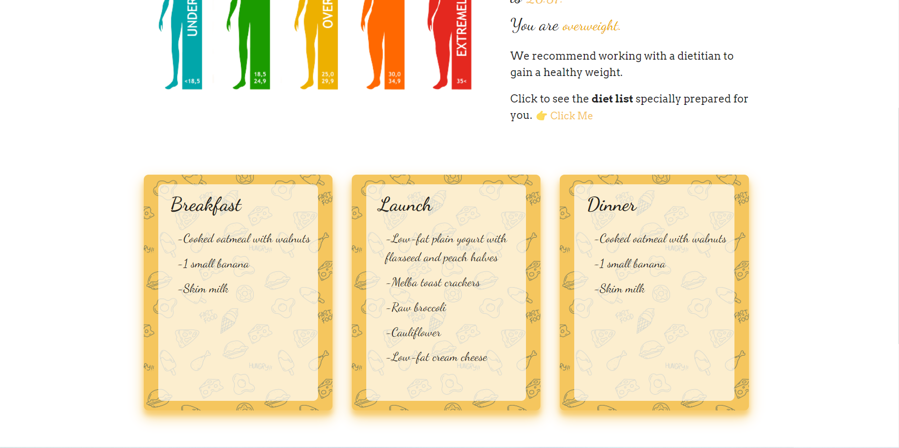
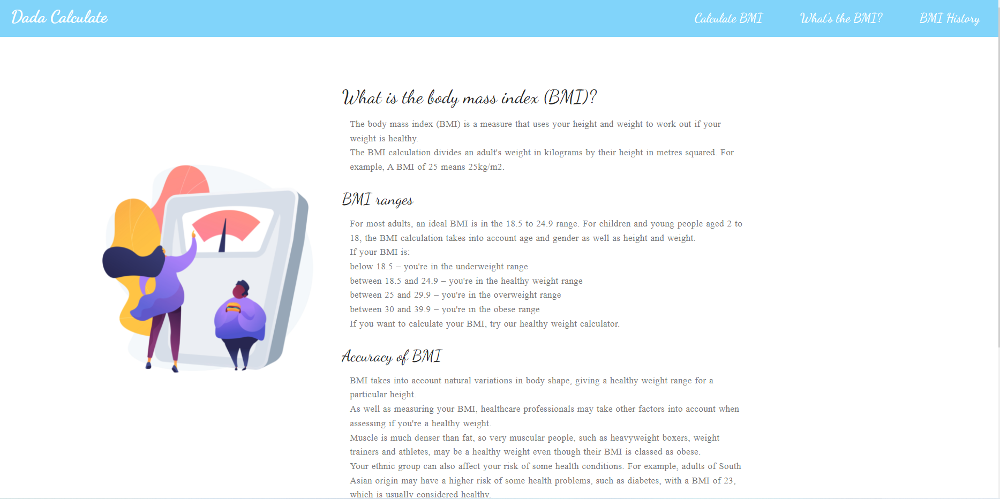
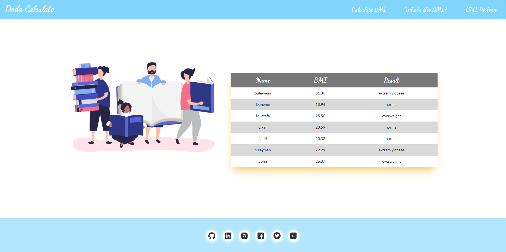

# Dada Calculate BMI App

## It is an application that calculates BMI (body mass index) according to body weight and height.

- This application is written using the <b>React</b> library.
- <b>Context API</b> is used for data transfer in this application.
- Calculated BMIs are saved in <b>Local Storage</b>. It can be viewed again later in the history section.
- <b>React-Router-Dom</b> package is used for switching between pages. It allows us to display pages and allow users to navigate them

### [Dada Calculate App Link (click me)](https://dadacalculate.netlify.app/)

 

